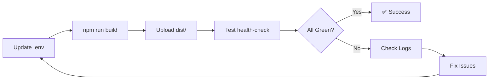

# Deployment Checklist - Single Source API URL

## ✅ Pre-Deployment

### 1. Update `.env` File

**Development:**
```env
VITE_API_URL=https://localhost:7288/api
```

**Production:**
```env
VITE_API_URL=https://api.yourchurch.com/api
```

**Staging:**
```env
VITE_API_URL=https://staging-api.yourchurch.com/api
```

### 2. Verify Configuration

Run this in your project root:

```bash
# Check current .env value
cat frontend/.env | grep VITE_API_URL

# Expected output:
# VITE_API_URL=https://your-domain.com/api
```

### 3. Build Application

```bash
cd frontend
npm run build
```

**Expected console output:**
```
✓ built in XXXms
```

### 4. Verify Build

```bash
# Check that config.js is included in dist
ls frontend/dist/config.js

# Check that Service Worker is included
ls frontend/dist/firebase-messaging-sw.js
```

## ✅ Deployment

### 1. Deploy Backend

- Upload backend to your server
- Note the **exact URL** where it's accessible
- Example: `https://api.yourchurch.com`

### 2. Update Frontend `.env`

```env
VITE_API_URL=https://api.yourchurch.com/api
#              ↑ Match your backend URL exactly!
```

### 3. Rebuild Frontend

```bash
cd frontend
npm run build
```

### 4. Deploy Frontend

Upload contents of `frontend/dist/` to your web server.

**Important files to verify are uploaded:**
- ✅ `index.html`
- ✅ `firebase-messaging-sw.js` (Service Worker)
- ✅ `config.js` (Test page config)
- ✅ `test-accept.html` (Test page)
- ✅ `health-check.html` (Health check)
- ✅ All `assets/` folder contents

## ✅ Post-Deployment Verification

### 1. Test Backend Availability

```bash
curl https://api.yourchurch.com/api/assignments
# Should return 401 Unauthorized or similar (backend is running)
```

Or open in browser:
```
https://api.yourchurch.com/
# Should show Scalar API documentation
```

### 2. Test Health Check Page

```
https://yourchurch.com/health-check.html
```

**Expected result:**
```
✅ Auth Token: [depends on login status]
✅ Service Worker: Active
✅ Backend API: Running on https://api.yourchurch.com/api
    Source: .env VITE_API_URL
```

### 3. Test Main Application

1. Open: `https://yourchurch.com`
2. Log in
3. Create a test assignment
4. Check notification appears
5. Click **Accept** button
6. Verify assignment status changes

### 4. Check Browser Console

**Expected logs:**
```
[NOTIFICATIONS] ✅ API URL configured: https://api.yourchurch.com/api
[NOTIFICATIONS] Source: .env VITE_API_URL
[SW] ✅ API URL updated from main app: https://api.yourchurch.com/api
[CONFIG] API URL: https://api.yourchurch.com/api
```

## ✅ Troubleshooting

### Issue: Health check shows wrong URL

**Solution:**
1. Check `.env` file has correct URL
2. Rebuild: `npm run build`
3. Re-deploy `dist/` folder
4. Clear browser cache
5. Hard refresh: Ctrl+Shift+R

### Issue: Accept button calls wrong URL

**Solution:**
1. Clear Service Worker:
   ```javascript
   navigator.serviceWorker.getRegistration().then(r => {
     if (r) r.unregister();
   }).then(() => location.reload());
   ```
2. Open main app again (initializes config)
3. Try accept button again

### Issue: Test pages show "undefined"

**Cause:** localStorage not set (main app not opened yet)

**Solution:**
1. Open main app first: `https://yourchurch.com`
2. Wait for it to load completely
3. Then open test pages

### Issue: CORS errors

**Cause:** Frontend and backend on different domains

**Solution:** Configure CORS in backend:

```csharp
// backend/ChurchRoster.Api/Program.cs
builder.Services.AddCors(options => {
    options.AddPolicy("AllowFrontend", policy => {
        policy.WithOrigins("https://yourchurch.com")
              .AllowAnyMethod()
              .AllowAnyHeader()
              .AllowCredentials();
    });
});

app.UseCors("AllowFrontend");
```

## ✅ Environment-Specific Configs

### Multiple Environments

Create separate `.env` files:

```
frontend/
├── .env                    # Default (not in git)
├── .env.development        # Dev environment
├── .env.staging           # Staging environment
├── .env.production        # Production environment
└── .env.example           # Example template (in git)
```

### Build for Specific Environment

```bash
# Development
npm run dev
# Uses: .env.development

# Production
npm run build
# Uses: .env.production

# Custom staging
vite build --mode staging
# Uses: .env.staging
```

### CI/CD Integration

**GitHub Actions Example:**

```yaml
# .github/workflows/deploy.yml
- name: Create .env file
  run: |
    echo "VITE_API_URL=${{ secrets.API_URL }}" > frontend/.env
    echo "VITE_FIREBASE_API_KEY=${{ secrets.FIREBASE_KEY }}" >> frontend/.env

- name: Build
  run: |
    cd frontend
    npm ci
    npm run build
```

**Set secrets in GitHub:**
- Repository → Settings → Secrets → New repository secret
- Name: `API_URL`
- Value: `https://api.yourchurch.com/api`

## ✅ Rollback Plan

If deployment fails:

### 1. Revert `.env` to previous value

```bash
git checkout HEAD -- frontend/.env
```

### 2. Rebuild with old config

```bash
cd frontend
npm run build
```

### 3. Re-deploy old build

Upload previous `dist/` folder backup.

## ✅ Success Criteria

Deployment is successful when:

- ✅ Health check shows all green
- ✅ Main app loads without errors
- ✅ Login works
- ✅ Notifications appear
- ✅ Accept button changes assignment status
- ✅ No console errors
- ✅ Service Worker active
- ✅ All API calls go to production URL

---

**Deployment Process Summary:**



---

**Key Takeaway:** With single source configuration, you only need to update **ONE LINE** in `.env` to deploy to any environment! 🎉

